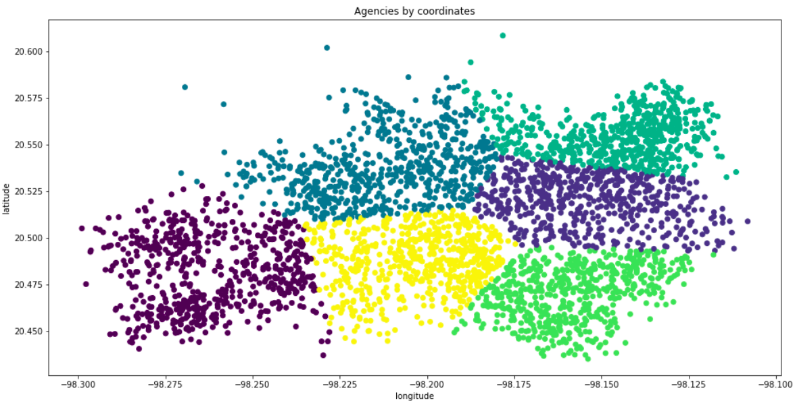

## The challenge
We need to **create 6 zones**, can be understand as **distribution centers** (based on the 6 days of the deliverable week) and make sure that the **distance we travel in each zone is the minimum**, without surpassing the **distribution daily constraints** such as **balanced stops** and **volumes**. In other words the zones should have the same amount of stores and same load in "trucks".

### Distance between points
We need to calculate the distance between all points, in other words we need to create a distance matrix. So there are a wide variety of distance metrics we can use, as well as services to extract more precise distance, we will not limit to just one such as euclidean distance, but the following:
* Manhattan distance or taxicab: 
* Harvesine 
* Euclidean (off course)

### Steps to the victory.
First of all we will make an EDA for our raw data in R programming language, obtaining:
-central tendency metrics/measures
-standard deviation
-quartiles
For our delivery volume and frequency.

After that we will plot this variables, with charts like scatterplot, boxplot, histogram, in order to observe our earlier results as graphics.

Then we will make other EDA but for each frequency, because our data only contain the values one, two and three.
In each particular frequency we will obtain the central tendency metrics/measures, standard deviation and quartiles but also make four plots (paired in only one) to observe our metrics by a graphical way.

After finalizing this EDAs, we will apply three types of distances to our dataset, this in Python.

The first one is the Harvesine distance, in order to use this one we will transform our coordinates to radians.
Sklearn defines this distance as follows: "The Haversine (or great circle) distance is the angular distance between two points on the surface of a sphere. The first distance of each point is assumed to be the latitude, the second is the longitude, given in radians."

The second one is the euclidean distance, this one is the most used, the classic of distances metrics.
It's also called the pythagorean distance because it obeys the following properties, symmetric, positive and follows the triange inequality.

And the third one is the Manhattan distance also called the Taxicab geometry distance, The Manhattan distance as the sum of absolute differences, give two coordinates (a, b), (x, y), the Manhattan Distance is given by the sum of the difference of the absolute values entry-entry.

After this steps we need to reshape this distances to a one dimension vector in order to get an analysis of this results, to get this we use the reshape method python provides.

We will create a function called compute_metrics that will compute all the metrics we used on the EDA and also excess kurtosis and skewness, this function will return a string with all the values.

Then we are going to plot the histograms for each distance and on the same plot show the string given by our function, this is to have in the same plot all the information needed to analyze which distance we will use in future algorithms.

### Algorithms used
We will try to make clustering using K-means, sklearn says:
"The KMeans algorithm clusters data by trying to separate samples in n groups of equal variance, minimizing a criterion known as the inertia or within-cluster sum-of-squares (see below). This algorithm requires the number of clusters to be specified. It scales well to large number of samples and has been used across a large range of application areas in many different fields.

The k-means algorithm divides a set of _N_ samples X into _K_ disjoint clusters _C_, each described by the mean of the samples in the cluster. The means are commonly called the cluster “centroids”; note that they are not, in general, points from _X_, although they live in the same space."

Other will be the GMM (Gaussian Mixture Models), defined as follows: "A Gaussian mixture model is a probabilistic model that assumes all the data points are generated from a mixture of a finite number of Gaussian distributions with unknown parameters. One can think of mixture models as generalizing k-means clustering to incorporate information about the covariance structure of the data as well as the centers of the latent Gaussians." (sklearn) 

Density-Based Spatial Clustering of Applications with Noise (DBSCAN) is a base algorithm for density-based clustering. It can discover clusters of different shapes and sizes from a large amount of data, which is containing noise and outliers."
Finally also try DBSCAN which is a density based clustering algorithm, KD Nuggets defines it as follows: "Density-Based Clustering refers to unsupervised learning methods that identify distinctive groups/clusters in the data, based on the idea that a cluster in data space is a contiguous region of high point density, separated from other such clusters by contiguous regions of low point density.

### Future steps:
* DBSCAN algorithm approach did not work from our side, but we can get outliers (noise) from that model, then treating those observations different. 
* It would be great to implement own version of KMeans where once a zone has met the balance constraints needs to be assigned to other cluster.
* Better way of measuring distances on optimization problem, for example TSP or mean centroid-agencies.

### Files included:
* Under the EDA path you will find EDA.html and Distances notebook, both were used to display EDA outputs, we were thinking uploading them to a Flask server however got no time. In order to generate EDA html file kindly use Rdm file.
* Under the solution path you will find everything needed to solve the problem using balanced kmeans, IP and MILP. Solely balanced Kmeans model can be found on contrained_kmeans.ipynb for Constrained KMeans only. Jupyter notebook for IP and MILP visualizations can be found under optimiztion_viz.ipynb. To implement iterations over MILP solved with cplex open cplex_optimization.py To run it please type on the terminal python cplex_optimization.
* test.py: To test how good is a particular solution according to distance minimization and stops plus distribution balance constraint.
* utils.py: Includes information for different distance metrics. 

# Why Zoltar
Zoltar is a fortune teller machine, basically the machine once receiving a coin outputs a prediction of the readers future and being realistic, this tipically given by an automaton. We are a brothers team trying to predict Mexico's Logistic's challenge for AB Inbev 2020 data cup. With these optimizations we reach 4th place one week after the hackathon finished, around 7% below first place.
